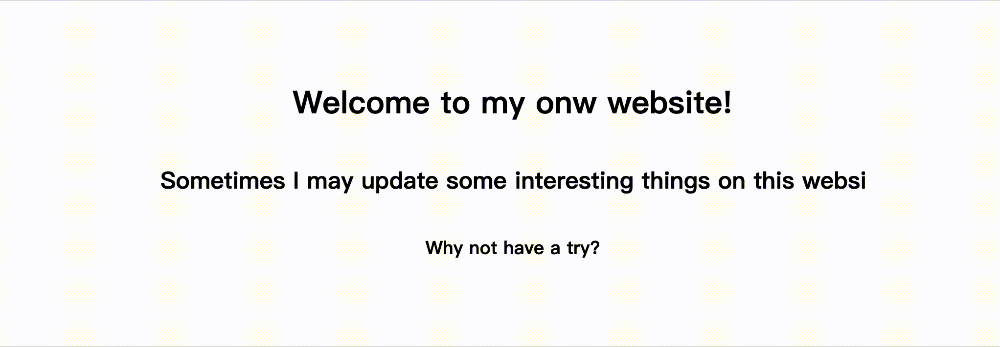

任何项目当然都需要一个引导页啦

以前我的项目引导页都是直接上我的个人信息啥的，没啥新意，这次使用 css 实现了打字机效果，带给人不一样的感受

整体实现非常简单，就是在 content container 中设置三个标题（h1, h2, h3），然后使用 animation 属性让文字从左到右显示

显然容易想到 animation 中的属性应该是 width，可以使得 width 从 0 到 auto

其次，需要使用到 css 度量单位中的 ch，是 css3 新增单位，代表数字 0 的宽度，那么我们有多少个文字其 width 当然就是多少

再然后根据三个标题的动画时间设置三个标题的延时，这样就可以使得三个标题连续 typing 啦

```css
@keyframes typing {
  from {
    width: 0;
  }
}

h1 {
  width: 26ch;
  animation: typing 4s steps(26) 1;
}

h2 {
  width: 66ch;
  animation: typing 12s steps(66) 1 4s;
}

h3 {
  width: 19ch;
  animation: typing 6s steps(19) 1 15s;
}
```



您可以访问[此处](https://zly201.github.io/canvas/#/home)进行预览
