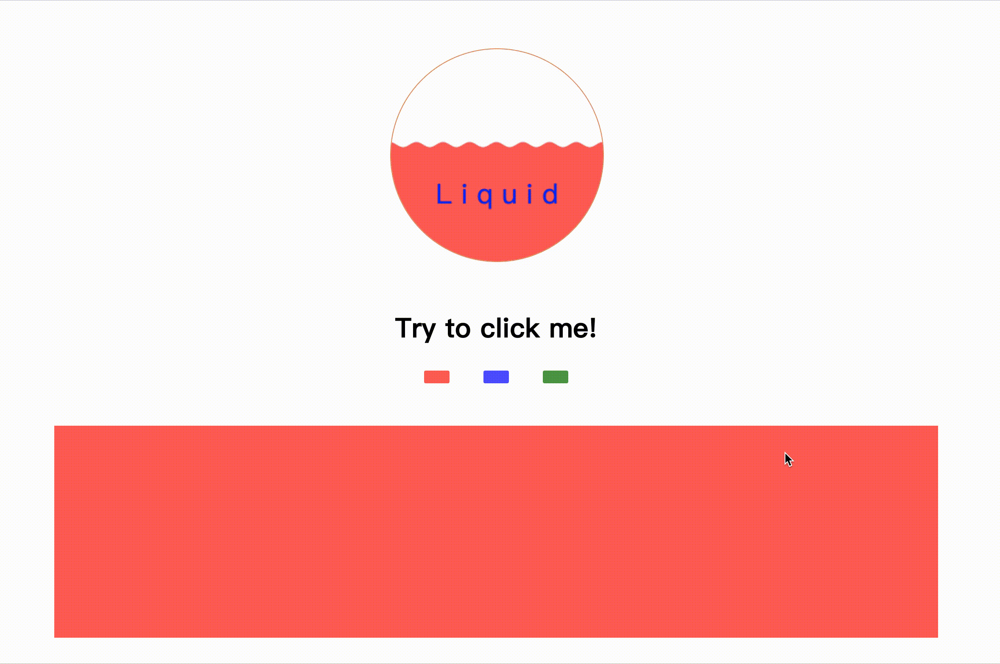
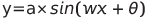
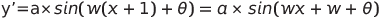
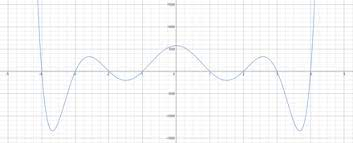

这个页面主要用于学习 canvas 的用法（至于为什么要学习，只因为导师上次问我用过 canvas 没有，我说没用过。。。）

其实很早以前使用 hexo 搭建博客的时候就有了解过 live2d，参观别人的博客发现下边有湍急的河流，一直想自己也手动实现一下，但是苦于没有实力，这次总算是实现了一个小 demo

可以看到这个页面的名字叫 liquid，也就是液体的意思，也就是用 canvas 画出类似于液体的效果，并且分为手动和自动的部分

如果你参观过成品就会发现上边有一个圆形容器，装满了不明液体，下边看上去是平平无奇的块状物体，但是当你点击它们就会有神奇的事情发生

页面布局应当不用细说，实现的方式也是多种多样，我们就来聊一聊 canvas 的具体实现

### 自动液体

首先是上层的圆形容器

第一步，我们需要把圆形给画出来，相信大部分人想到的是调用 ctx.arc 方法，其实大可不必，我们直接设置 canvas 的 border-radius 为 50% 就好了

其次，我们需要让容器被液体充满，只需要设置一个等高线，然后调用 ctx.fill 即可

然后，我们需要让其在等高线处画出波纹，这就要用到初等数学的知识了，相信大家都知道  是正弦曲线，那么我们可以在等高线处设置适量的点，然后根据其横坐标计算出其高度值，当然此处的参数需要调试

波纹画出来了，如何让它动起来呢

很明显我们需要用到 setInterval 方法让其往右偏移，显然有

那么我们只需要在定时器内部对每个点的 theta 加上 w 即可

最后是点击产生气泡的效果，显然这个地方也要用到定时器，但是如果在一个 canvas 是不能同时进行两种绘制操作的，所以我们需要新建一个 canvas 覆盖在原来的 canvas 之上，用于产生气泡，我将其称之为 bubbleCanvas

这个相较于波纹应当容易的多，我们只需在点击处周围绘制适量气泡，然后设置定时器改变气泡的位置，就可以产生气泡向上移动的效果

为了更加接近真实情况，在气泡向上漂移的过程中气泡会逐渐变小，那么我们改变其位置的同时减小其半径即可，当气泡跑出等高线我们将定时器的 timer 清除即可

### 手动液体

其次是下面的粘稠液体，这个相较于圆形容器要难的多

首先可以知道对于一个高次函数，多次求导的话就会使其变为 0

我们考虑在二位坐标内绘制一个对称的高次函数，如下图所示

我们对其不停的求导，那么其最终会变成一条直线

那么我们同样只需要设置一条等高线，然后从宽边的中间开始绘制高次函数，与求导类似，不过这里使用的是差分，对一个函数不断差分处理的话其最终也会变成一条直线

这里还有一个问题，我们绘制完一次后第二次绘制会覆盖上一次的结果，我们需要调用 ctx.save 方法保存其上一次的状态

由此我们就完成了 liquid 页面的编写

参考：[《每周一点canvas动画》——差分函数的妙用](https://segmentfault.com/a/1190000007206262)

您可以访问[此处](https://zly201.github.io/canvas/#/liquid)进行预览
