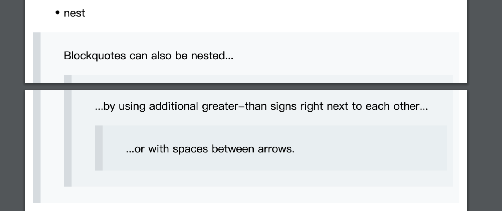
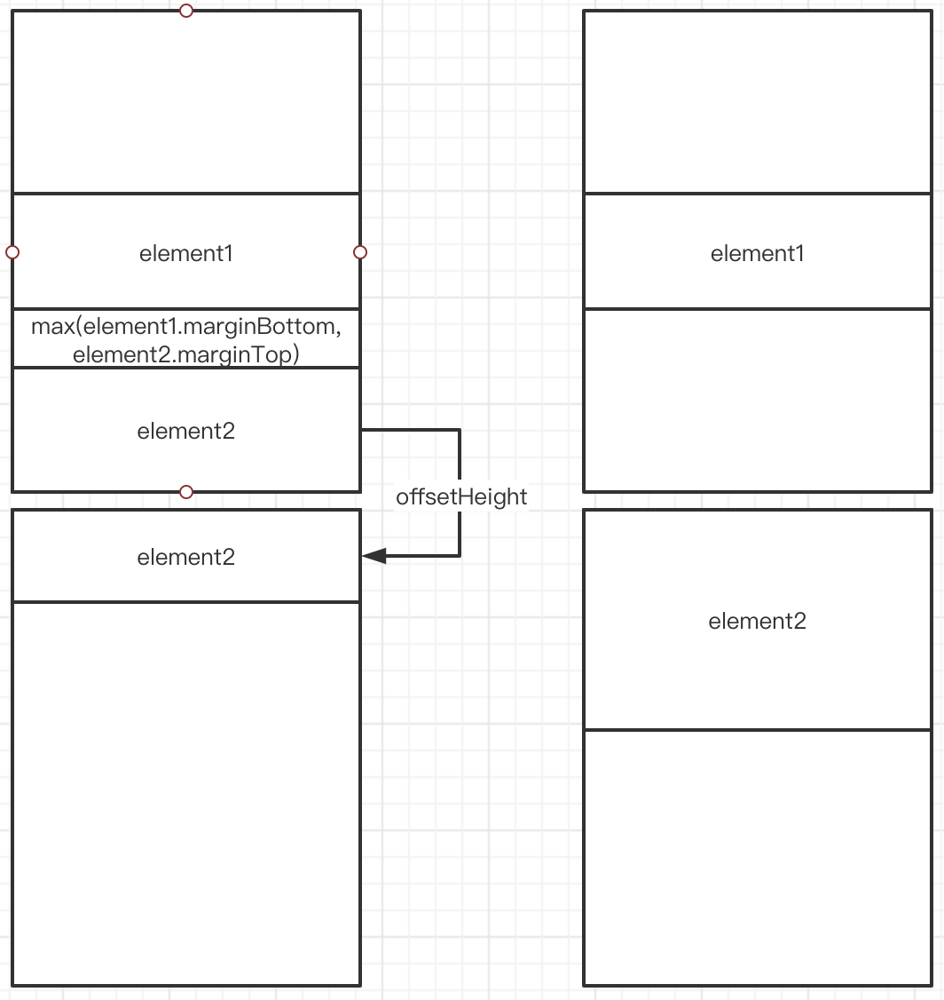
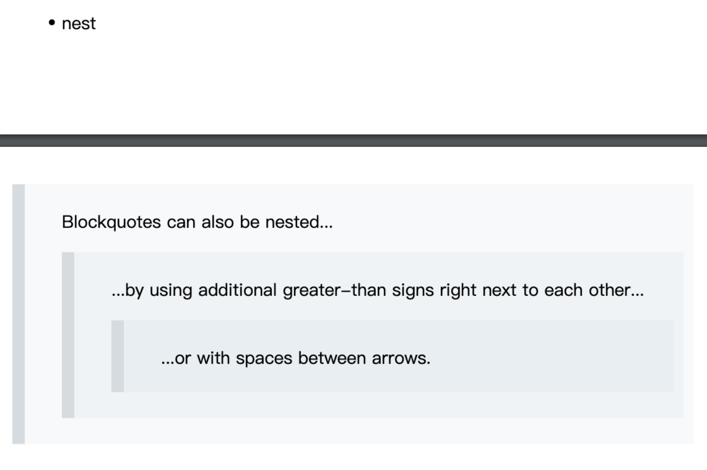

市面上的 markdown 插件有很多，这里使用的是 [react-markdown](https://github.com/remarkjs/react-markdown)

将页面布局好之后按照官方文档一顿操作相信大家都可以做出不错的 demo 来，我就不详细叙述了

初期的 demo 恐怕只有一个比较难的点就是同步滚动

大家可以参考[这篇文章](https://juejin.cn/post/6844903539353845767)，大体思路就是根据编辑框和预览框的高度比进行换算，然后调用 scrollTo 函数使得滚动条平滑移动

后面我有加上了两个功能，一个是 save as html，一个是 save as pdf

save as html 很好实现，只需要把预览区的元素取出来放到新页面中就好了

save as pdf 就比较复杂，这里主要用到了 html2canvas 和 JsPDF

要将其转换为 pdf 首先需要将其转化成图片，可以使用 html2canvas 将其绘制到画布上然后转成 image，使用 JSPDF 绘制到 pdf 中

可是没想到第一步就出问题了，html2canvas 只能获取容器可见部分，而不能获取 offsetHeight 以外的部分

为了解决这个问题我们需要将其克隆出来并挂载到某个容器里面并设置其 height 为 auto 让其为子元素自动撑开，为了不影响整体页面的布局，该容器必须是不可见的

```javascript
...
const copyPreview = preview.cloneNode(true) as HTMLDivElement;
copyPreview.style.width = `${A4Width - 20}px`;
copyPreview.style.height = 'auto';
copyPreview.style.padding = "0 10px";
if (this.clonePreview.current) {
  this.clonePreview.current.appendChild(copyPreview);	//挂载到某个不可见的容器内部
} else {
  console.error("clonePreview not find");
  return;
}
...
```

但是很快，我又遇到了第二个问题

当我挂在完毕后立即渲染的时候出现截图不全的情况，经过反复筛查发现是因为预览区中引入了外部图片，当图片没有加载完成的时候，克隆出来的元素的 offsetHeight 会小于原来的高度

为了解决这个问题，可以使用 await 等待一段时间后继续操作

```javascript
...
await new Promise<void>(resolve => {
  setTimeout(() => {
    resolve();
  });
});
...
```

然后你会遇到第三个问题，就是 PDF 渲染出来后发现文字模糊，且在纸张边界处出现了段落隔断的现象



首先解决文字模糊的问题，经过查询后在 html2lcanvas 的 options 中加入 `scale:window.devicePixelRatio` 问题解决

其次解决段落隔断问题

考虑纸张的大小已知，那么我们可以设置各个元素的 margin-top 来将其偏移，每当出现隔断的情况将其另起一页即可



看了上面这张图相信大家应当知道如何计算向下的偏移量了

我们可以维护一个 curHeight 用于记录当前单个页面的占用高度是多少，如果 curHeight + margin + offsetHeight > pageHeight 的话就应当将其向下偏移，偏移量根据上图计算即可

为了获取元素真实的 margin，需要用到 document.defaultView.getComputedStyle 方法获取其在 dom 中渲染过后的 margin 而不是 style 中的 margin



似乎按照上述方法渲染较慢，如果有更好的实现方式可以 @我

您可以访问[此处](https://zly201.github.io/canvas/#/markdown)进行预览