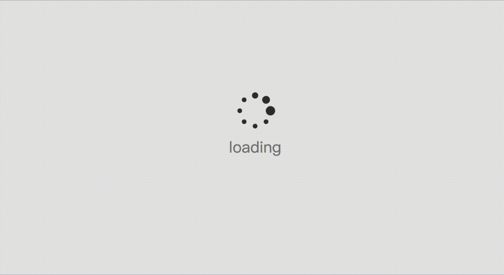
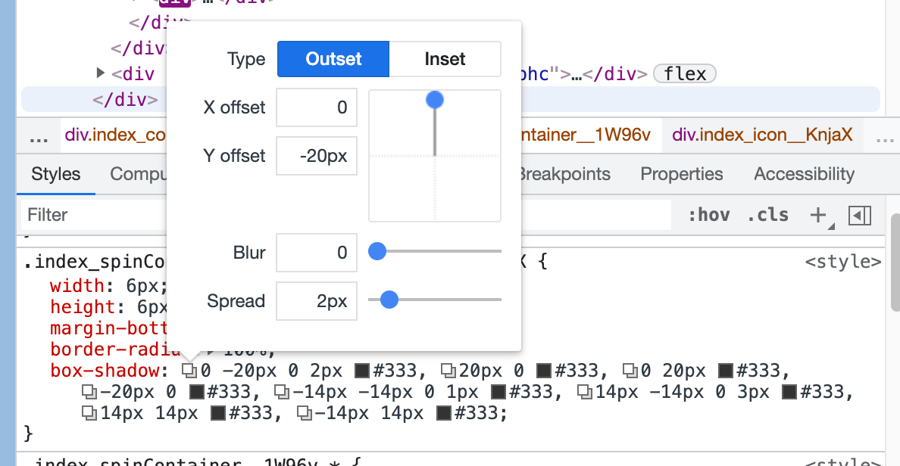

为了提升用户体验，该项目引入了 React 路由懒加载，即在页面切换加载时新增加载中页面



路由懒加载的使用就不再这里说明了，不会的同学请自行百度

这里使用纯 css 实现 loading 界面，而不是 background-image

主要用到了 css 中的 box-shadow 样式

贴上 MDN 的 box-shadow 语法

```
/* x偏移量 | y偏移量 | 阴影颜色 */
box-shadow: 60px -16px teal;

/* x偏移量 | y偏移量 | 阴影模糊半径 | 阴影颜色 */
box-shadow: 10px 5px 5px black;

/* x偏移量 | y偏移量 | 阴影模糊半径 | 阴影扩散半径 | 阴影颜色 */
box-shadow: 2px 2px 2px 1px rgba(0, 0, 0, 0.2);

/* 插页(阴影向内) | x偏移量 | y偏移量 | 阴影颜色 */
box-shadow: inset 5em 1em gold;

/* 任意数量的阴影，以逗号分隔 */
box-shadow: 3px 3px red, -1em 0 0.4em olive;
```

显然我们要实现上述效果需要几个连续变大的球，然后让整个图形无休止的旋转，这样就可以产生上图中的视觉效果

```css
@keyframes spin {
  from {
    transform: rotate(0deg);
  }
  to {
    transform: rotate(360deg);
  }
}
```

根据 MDN 上的描述，我们可以添加任意多的阴影，只需使用逗号分隔即可，这里选择阴影数量为八个，因为为了使得观看效果尽量好，我们需要在上，下，左，右，上左，上右，下左，下右八个方向上设置阴影，我们只需设置八个阴影的偏移量即可



至于阴影的大小可以通过设置阴影的扩散大小和模糊半径来改变

```css
box-shadow: 0 -20px 0 2px #333,
            20px 0 #333,
            0 20px #333,
            -20px 0 #333,
            -14px -14px 0 1px #333,
            14px -14px 0 3px #333,
            14px 14px #333,
            -14px 14px #333;
```

您可以访问[此处](https://zly201.github.io/canvas/#/spin)进行预览