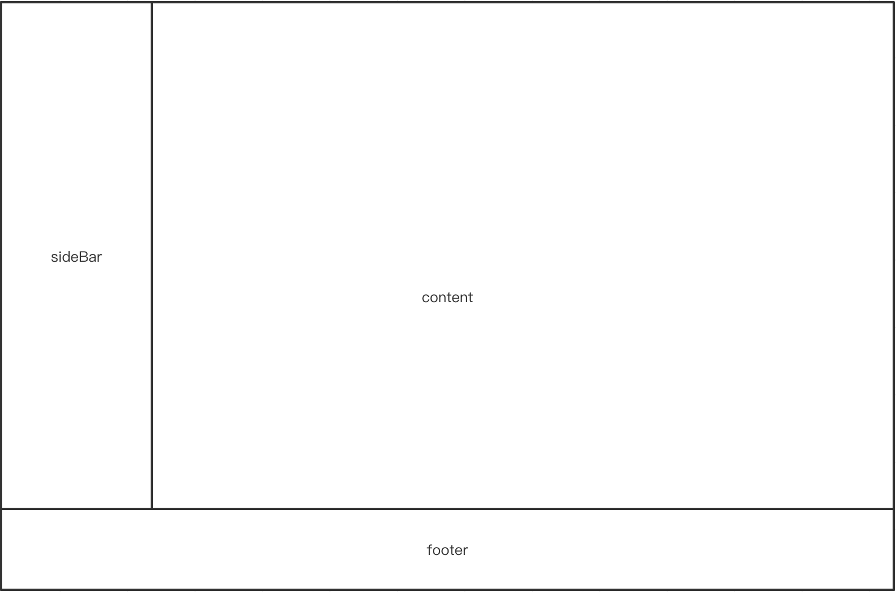

##  前言

学习前端已经将近两年了，期间虽然也做过一些小的项目，而且进入了某大厂实习，但是总感觉自己的知识点掌握的不到位，特别是实习期间，学到了很多以前没有见过的东西，最近正赶上秋招，于是着手开始了这个项目，希望把一些以前自己有过的想法但是没来的及实现的东西揉合到这个项目中，包括 React 框架，其实一直没有一个深入的理解，希望在这个项目中能有所收获

注：在我的笔记中只会记录项目实现的大体思路以及重要的知识点，可能不会面面俱到，有问题请在 issue 中 @我

## 项目设计

1. 使用 create-react-app 搭建基础的 React-typescript 框架

2. 使用 less 代替 css 对元素进行样式设计

3. 使用 SPA 技术搭建单页面应用，但是由于 github 不支持 BrowserRouter，需要使用 HashRouter 代替

## 项目搭建

1. 运行 `npx create-react-app my-app --template typescript` 搭建基础的 React-typescript 框架

2. 运行 `npm run eject` 暴露内置的 webpack 配置

3. 运行 `npm i less less-loader css-loader style-loader —save-dev` 安装所需的 less-loader

4. 在 `/config/webpack.config.js` 中添加 less 的相关配置，可参考内置的 sass 配置

5. 为了让 React 识别 less 文件还需要在 `/src/react-app-env.d.ts`  中设置样式的暴露规则

   （此条主要识别如下语法 `import style from *.less`）

6. 在根目录下新建 `.env.production`  文件并设置 `GENERATE_SOURCEMAP=false` 用于去除打包后的 sourcemap 文件，避免源码泄漏

7. 格式化之类的配置可以在根目录的 `.editorconfig` 或 IDE 中设置

## 页面设计

计划搭建单页面应用

整个页面分为侧边栏 (sideBar)，底部栏 (footer)，和内容区 (content)

其中侧边栏包含跳转页面的 link

底部栏包含版权信息、友情链接等

内容区则是页面展示的地方

很容易想到的布局方式就是绝对布局，将父元素设置为 relative，子元素设置为 absolute

或者可以采用 flex 布局方式，设置 sideBar 和 content 在同一容器内与 footer 为兄弟关系

这里为了简便采用绝对布局

这样一来整个项目的框架就搭建完毕了，接下来需要进行各个模块的设计，由于难度不大~~（不是）~~，在此就不赘述了
